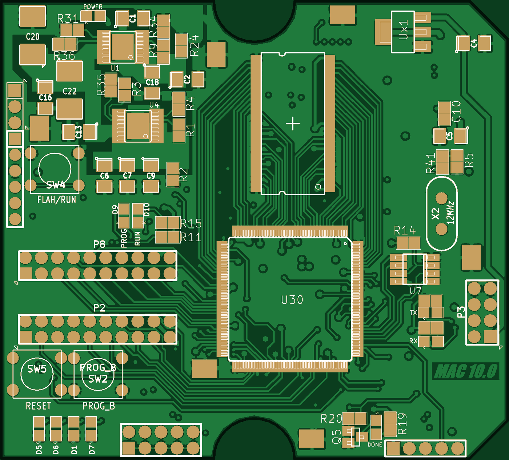
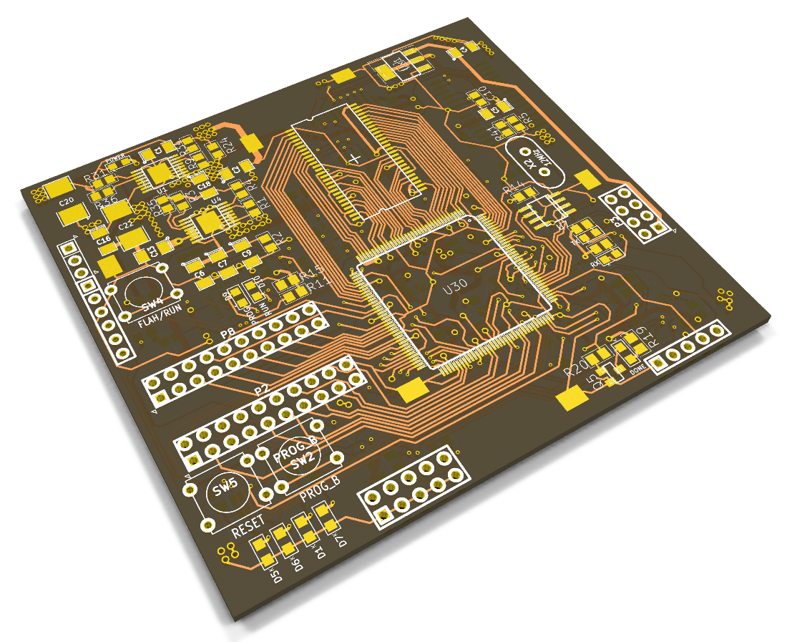
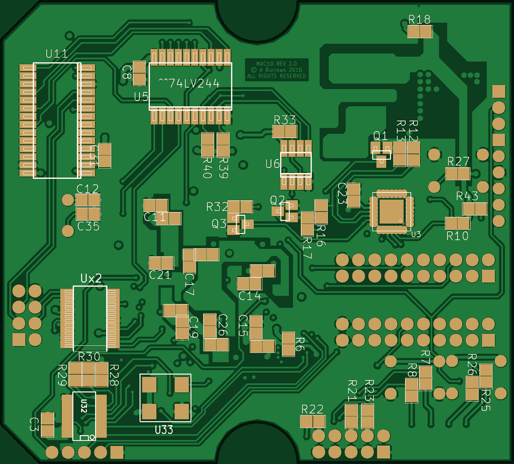
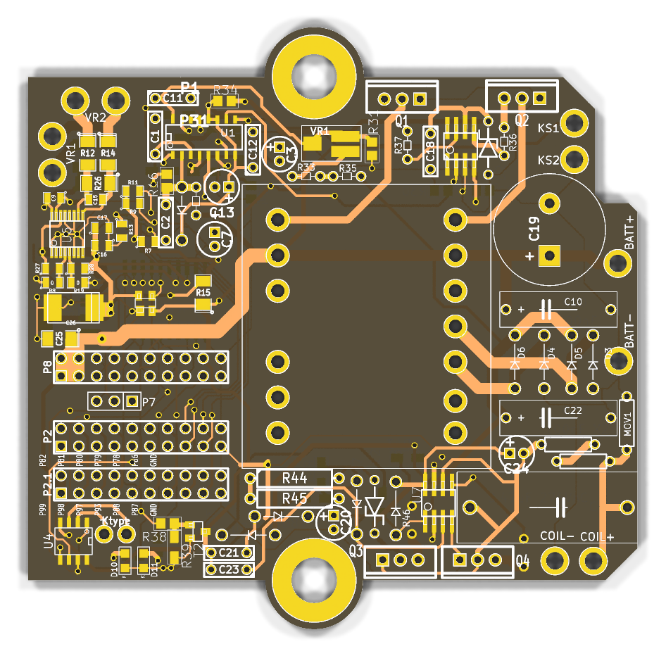

# MAC-10

An FPGA-based engine ignition controller (CDI), designed and built 2015–2017.

A Xilinx Spartan-6 runs a Z80 soft-core system (based on [socZ80](http://sowerbutts.com/socz80/)) with custom timer and capture peripherals. These measure engine position from a variable-reluctance pickup and fire a capacitor-discharge ignition stage on a stacked "top board".

> [!WARNING]
> The CDI board generates **several hundred volts DC** and drives an ignition coil. That can injure or kill. Do not build or power it unless you know how to work safely with high voltage.

## Boards

### Logic board: `hardware/logic-board/` (MAC10 REV 2.0)

| | |
|---|---|
| FPGA | Xilinx Spartan-6 **XC6SLX9-2TQG144** |
| Memory | Micron 256 Mb SDR SDRAM (16-bit), 2 × M25P80 SPI flash, XCF02S configuration PROM |
| Host link | FT232R USB-UART |
| Housekeeping | PIC18F2520 (programming / mode control), LT3081 regulators |
| Expansion | Two 20-pin headers (P8, P2) to the CDI board |

### CDI board: `hardware/cdi-board/` (MAC10 TopB)

The top board stacks on the logic board through P8 (and P2 on the last revision). P8 pin 11 carries the ignition trigger from FPGA pin 59.

| | |
|---|---|
| HV supply | TL494 PWM, TC4427 driver and MOSFET push-pull into an ET029 transformer (rev 4). Earlier revisions used a MAX1771 boost converter and a BT151 SCR. |
| Crank sensing | MAX9926 variable-reluctance sensor interface |
| Temperature | MAX31855 K-type thermocouple converter |
| Inputs | MAX6816 switch debouncers, 74LVC245 level buffering |

### Gateware: `gateware/`

An ISE 14.7 project (`gateware/fpga/socz80.xise`, top level `top_level.vhd`, pinout `papilio_pro.ucf`) built on socZ80:

- **T80** Z80 CPU core, MMU, Mike Field's SDRAM controller, UARTs, SPI flash master (upstream socZ80)
- **Ignition timing peripherals** (MAC-10 additions):
  - `timerD2`: capture timer on I/O ports `0x50`–`0x57`
  - `timer3`: on `0x40`–`0x47`
  - `oneshot`: drives the CDI trigger output
- **`INTERRUPT_1`** interrupt controller, plus extra GPIO ports at `0x39`/`0x3A`
- **`hex_to_vhdl/`**: a small C tool that converts the Z80 monitor's Intel HEX into `MonZ80.vhd`, the boot ROM image

The last built bitstream is `gateware/fpga/work/top_level.bit`. The SPI PROM images are in `gateware/programming_files/`.

## Opening the files

- **KiCad:** the design files are in the 2013 KiCad format (`eeschema (2013-07-07 BZR 4022)-stable`).
  - **Boards** (`.brd`) open directly in current KiCad (checked with 10.0).
  - **Schematics** (`.sch`) need KiCad's legacy import: open the project in the KiCad GUI and accept the *Remap Symbols* step. The symbols come from each project's `*-cache.lib`, which is committed. The original custom libraries are not needed.
  - Gerbers and drill files are in each board's `GERBERS/`/`gerbers/` folder.
- **Xilinx ISE 14.7:** open `gateware/fpga/socz80.xise`. Build outputs are not committed; rebuild to regenerate them.

## History

This repository was assembled in 2026 from the original project folders. Each commit is one dated backup snapshot from the time, replayed in order. Commit dates are the real file dates, and each commit body names the original backup folder.

- `hardware/cdi-board/` passes through several design generations: TopV1, then the MAC-10.0 Test Board, then TopB 2/2E/3 (MAX1771 boost + SCR), then TopB 4 (TL494 push-pull redesign). The silkscreen REV labels don't follow the folder numbering. Each commit message gives both.
- Build outputs, editor backups, compiled executables and third-party datasheets were left out of every snapshot.

## License

- **Gateware, Z80 software and tools** (`gateware/`): [GPL-3.0-or-later](LICENSES/GPL-3.0-or-later.txt). This is required by socZ80. Upstream files keep their own headers and licenses (T80 and SSRAM are BSD-style).
- **Hardware** (`hardware/`): [CERN-OHL-S-2.0](LICENSES/CERN-OHL-S-2.0.txt).
- **Docs and images** (`docs/`): CC-BY-4.0.

The board silkscreens read "© A Burrows 2016 ALL RIGHTS RESERVED". This repository leaves the artwork exactly as it was fabricated. The notice predates this open release, and the hardware is licensed under CERN-OHL-S-2.0 as stated above.

Copyright © 2013–2017 Antony Burrows.

## Credits

- [socZ80](http://sowerbutts.com/socz80/) by William R. Sowerbutts (GPLv3): the SoC, monitor, CP/M and MP/M ports and tools this design builds on
- T80 Z80 core by Daniel Wallner
- SDRAM controller by Mike Field
